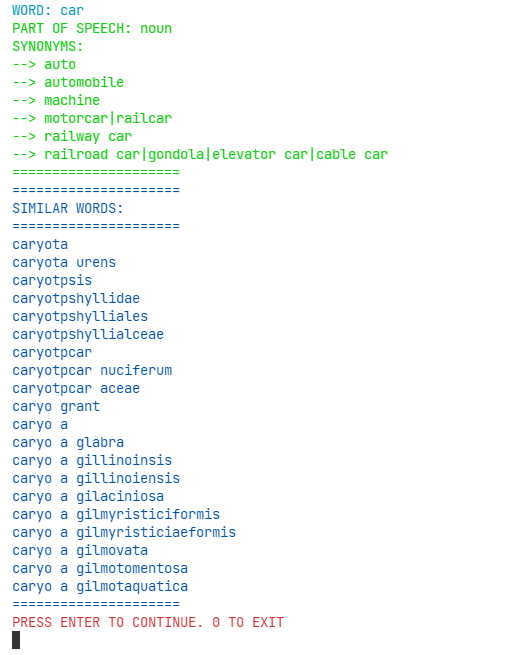

# Dictionary using Trie DS 

We have created a dictionary with synonyms using a "TRIE" datastructure

* We have done trie memory optimzation using the hashmaps

## Description

Trie is a data structure that have capability to manage dictionary words with less complexity. Trie is an efficient information reTrieval data structure. Using Trie, search complexities can be brought to optimal limit (key length). If we store keys in binary search tree, a well balanced BST will need time proportional to M * log N, where M is maximum string length and N is number of keys in tree. Using Trie, we can search the key in O(M) time. However the penalty is on Trie storage requirements (Please refer Applications of Trie for more details)


So we manged to implement a dictionary using Trie. 
* You can add words and synonyms to the Dictionary.
* You can search words in the dictionary



## Getting Started

### Dependencies

* The project was implement in **windows**
* C++

### Installing

You can clone the repo
```
(https://github.com/imranzaheer612/TrieDictionary.git)
```

### Executing program

* Just run it on a IDE or compile it using command
```
 g++ dictionary.cpp -o dictionary
```
* You will get a **dictionary.exe** file
  
## Help

When the program will ask you to enter a choice (1 , 2 or 0) to proceed and you hits enter,  it will still not proceed. You have to hit enter twice. 


## License

This project is licensed under the MIT License - see the LICENSE.md file for details
